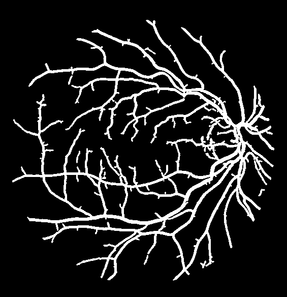
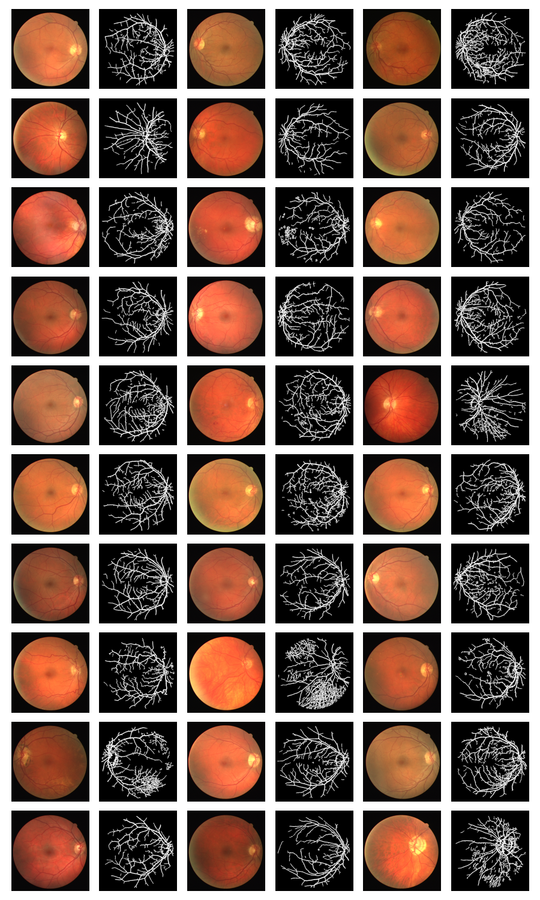

# Retinal Segmentation

This project is part of IE4476 Image Processing, a course offered by NTU

## Running it

You need to create a Python 3.8 environment, then:

```
pip install -r requirements.txt
python main.py
```

### Expected Output

The predictions will be output into the `data/` folder.

You'll expect these output from running it:
```
Evaluating Train Accuracy of Training Sample ...
======== Statistics ========
F1 Score: 80.06%
Sensitivity/Recall: 78.75%
Accuracy: 95.30%
============================
Saving Prediction of Training Sample in data/y_pred_train.gif ...
Saving Prediction of Testing Sample in data/y_pred_test.gif ...
Predicting other test samples as a collage
Saving Prediction of Other Test Samples in data/other_tests.png ...
```

## Summary

We analyzed and fine-tuned a single train image to segment a vessel boolean image.

| Train Image Input      | Train Image Expected Output | Train Image Actual Output  |
| ---------------------- | --------------------------- | -------------------------- |
|   |        |  |

### Results

Take results with caution, we only used 1 training sample and tested with that sample.

| F1 Score | Accuracy | Sensitivity (Recall) |
|----------|----------|----------------------|
| 80.06%   | 78.75%   | 95.30%               |

## Other Tests

We also ran it against images without ground truths


