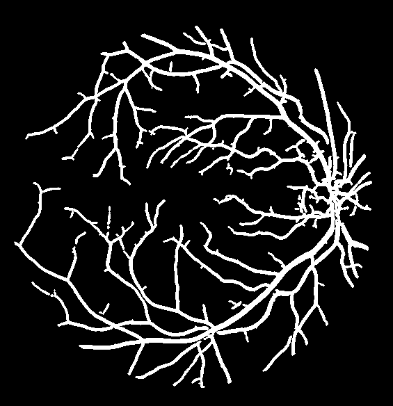

[](https://github.com/Eve-ning/IE4476-Retinal-Segmentation/actions/workflows/python-package.yml)
# Retinal Segmentation

This project is part of IE4476 Image Processing, a course offered by NTU

## At a Glance

We analyzed and fine-tuned a single train image to segment a vessel boolean image.

| Train Image Input      | Train Image Expected Output | Train Image Actual Output      |
| ---------------------- | --------------------------- |--------------------------------|
|   |        |  |

### Results

Take results with caution, we only used 1 training sample and tested with that sample.

| F1 Score | Accuracy | Sensitivity (Recall) |
|----------|----------|----------------------|
| 80.06%   | 95.30%   | 78.75%               |

## Running it

You need to create a Python 3.8 environment, then:

```shell
python -m pip install -r requirements.txt
python main.py preds
```

Remember to delete the environment when you're done!

> If you're having trouble running this, you can observe the expected output in `preds_gh/`, described below.

### Expected Output

The predictions will be output into the `preds/` folder.

> :bulb: I've also made GitHub automatically run the pipeline to output to `preds_gh/`, the output are similar.

You'll expect these output from running it:

```
Prediction Outputs at preds/ directory
Evaluating Train Accuracy of Training Sample ...
======== Statistics ========
F1 Score: 80.06%
Sensitivity/Recall: 78.75%
Accuracy: 95.30%
============================
Saving Prediction of Training Sample in preds/y_pred_train.tiff ...
Saving Prediction of Testing Sample in preds/y_pred_test.tiff ...
Predicting other test samples as a collage
Saving Prediction of Other Test Samples in preds/other_tests.png ...
```

## Other Tests

We also ran it against images without ground truths


